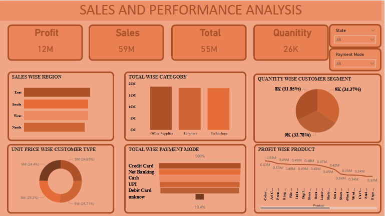

# Superstore Sales Analysis
## 🖼️ Dashboard Preview

## 📌 Project Overview

The Superstore Sales Analysis project focuses on analyzing sales and business performance data to identify important trends and patterns. The project uses data analysis and visualization techniques to understand sales, profit, products, categories, regions, and customer-related performance.

## 🛠️ Tools & Technologies

- Power BI
- Data Analysis
- Data Visualization
- Dashboard Development
- Business Intelligence

## 🎯 Objectives

- Analyze overall sales performance.
- Understand profit and sales trends.
- Identify high-performing categories and products.
- Analyze regional performance.
- Create an interactive dashboard for business analysis.
- Present important business information through visualizations.

## 📊 Key Analysis

The analysis focuses on:

- Sales
- Profit
- Products
- Categories
- Regions
- Customer performance
- Sales trends

## 💡 Key Insight

The dashboard provides a clear visual view of sales and business performance, helping identify important trends, high-performing areas, and opportunities for improving business performance.

## 📁 Project Type

Academic / Business Analytics Project

## 👩‍💻 Skills Demonstrated

Power BI | Data Analysis | Data Visualization | Business Intelligence | Dashboard Development
